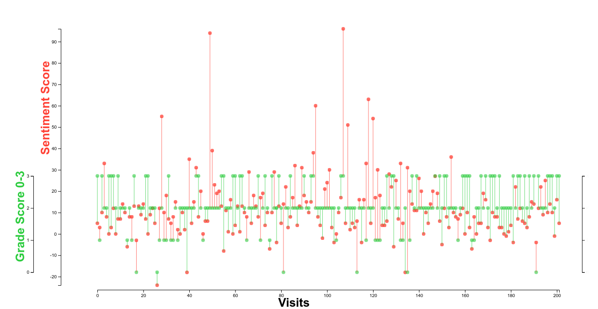

## This project visualized the disparity between number ratings reported by people from 0-4 vs. the sentiment score calculated by a common sentiment analysis algorithm (AFINN) run on the same people written comments.

(ianssmith.github.io/measuring_uncertainty)

### Contents:
- data/ raw data from source
- protoviz.ipynb : jupyter notbook with preliminary visualization and analysis.
- analyze.js is the node script which takes the raw data and runs AFINN sentiment analysis on the comments.(the result was piped into ap.tsv and wp.tsv).
- mean.awk : calculates the mean and standard deviation for the sentiment score calculated by analyze.js
- sketch.js/index.html/.css : interactive visualization of result.
